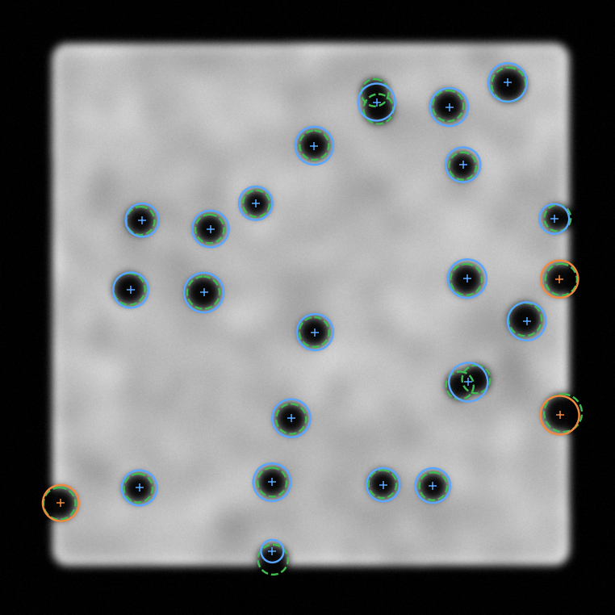

# Blocker detection in X-ray die images

Detecting near-constant-size dark discs ("blockers") in radiographic frames of a
bright rectangular die, **including blockers clipped by the die edge**, which is
where naive detectors fail.

This folder is a working prototype plus the reasoning behind the algorithm
choice. It runs on synthetic frames built to reproduce the failure modes of the
real `ISP_NF_*` images, so every claim below is measured rather than asserted.

```
python run_demo.py               # metrics on three synthetic frames
python run_demo.py --save out    # also write annotated PNGs
```

---

## 1. The actual problem

The edge case is not "a partially visible circle". It is more severe than that:

> Outside the die is black. A blocker is black. A blocker touching the die edge
> **merges with the background** and stops being a distinguishable object.

There is no local evidence at all — no closed contour, no enclosed dark region,
no intensity anomaly. A blocker whose centre sits outside the die silhouette is
simply a bite missing from the part's outline. Every "find dark round blobs"
method (threshold + connected components, LoG/DoG blob detection, template
matching, an off-the-shelf blob detector) is *structurally* unable to see it,
no matter how the parameters are tuned.

Secondary difficulties visible in the three frames:

| Property | Consequence |
|---|---|
| Blur varies a lot between frames (crisp `Q15B` → heavily smoothed `Q31B`) | Fixed-scale detectors and fixed edge thresholds do not transfer |
| Apparent blocker radius differs per frame (~21 px vs ~33 px) | The radius must be **measured per frame**, not hard-coded |
| Touching / overlapping pairs form dumbbells | Connected components under-counts; needs splitting |
| Bright rim inside the die edge + left/right illumination gradient | A global grey threshold cannot work |
| Faint concentric ring artifacts | Classic Hough-circle false positives |

---

## 2. Recommended approach

**Reconstruct a blocker-free reference of the die, then detect where the frame
falls short of it.** Never look for dark things.

Grey-scale morphological **closing** with a disc structuring element larger than
a blocker fills every dark valley narrower than the element. Applied to the
frame it produces "the die as it would look with no blockers" — and because
closing also bridges the concavity where a blocker has bitten into the outline,
**interior blockers and edge blockers both reappear in the same residual map,
with the same polarity and the same normalisation.** The edge case stops being
a special case.

```
residual = (closing(image, disc(1.9·r)) − image) / closing(image, disc(1.9·r))
```

Dividing by the reference cancels the bright rim, the illumination gradient and
the frame-to-frame exposure difference at once, so one fixed threshold means the
same thing on all three frames.

The same trick on the binary silhouette recovers the *ideal* die outline:
binary closing fills the (concave) bites while leaving the genuine (convex)
corner rounding untouched. That distinction is precisely what separates "a
blocker ate the corner" from "the die has rounded corners".

### Full pipeline

| # | Stage | Technique | Why this one |
|---|---|---|---|
| 1 | Die silhouette | Otsu → largest component → **fill holes** | Filling holes makes interior blockers part of the die, so the only remaining concavities are edge bites |
| 2 | Ideal silhouette | Binary closing, disc `1.9·r` | Recovers the un-bitten outline; convex corners survive |
| 3 | Radius calibration | Median equivalent radius of high-solidity interior holes | Radius is per-frame; solidity filter skips merged dumbbells |
| 4 | Residual | Grey closing, contrast-normalised | Scale-free blob map; edge bites included for free |
| 5 | Centres | **Fast Radial Symmetry Transform** (Loy & Zelinsky 2002) at `{0.85, 1.0, 1.15}·r` | See below |
| 6 | Recall insurance | Distance-transform + h-maxima **watershed** on the residual | Catches weak blurred blobs; splits dumbbells by construction |
| 7 | Refinement | **RANSAC circle fit with a radius prior** on the arc | Removes the inward centroid bias on truncated blockers |
| 8 | Scoring / NMS | depth × arc support, radius consistency, distance NMS | Kills ring artifacts and duplicates |

### Why FRST rather than Hough or template matching

This is the key algorithmic choice, and it is driven by "blockers are almost
consistent in size".

- **FRST** votes *once per gradient pixel* into a single accumulator cell at a
  known radius. The vote is additive and purely local, so a blocker showing only
  a 40% arc deposits 40% of the votes **at the correct centre — which may lie
  outside the die**. Nothing in the transform assumes the blob is whole.
  Truncation costs you vote mass, not correctness.
- **Hough circles** smear each vote across a radius range and are notoriously
  peaky-on-noise. With ring artifacts present they generate exactly the wrong
  kind of false positive. Hough *would* work here — it shares FRST's tolerance
  of partial arcs — but it is slower and needs more suppression machinery for
  the same result. Use it as a fallback if FRST underperforms on real data.
- **Template matching / matched filters** correlate a disc template with the
  image. NCC degrades badly under truncation unless you use **masked NCC**
  (Padfield 2010), normalising over valid pixels only. That is a legitimate
  alternative to stage 5 and is worth trying — but it needs one template per
  blur level, whereas FRST is blur-agnostic once run on the residual.
- **LoG / DoG blob detection** (`skimage.feature.blob_log`) handles the blur
  variation well via scale space, but its response is both weakened *and
  shifted* for truncated blobs. Fine for interior blockers, wrong at the edge.

### Why the boundary guard matters

In the residual, the straight cut where a bite meets the die outline is a strong
edge. Left alone it votes for a phantom centre exactly one radius inboard of
every boundary pixel — the classic false-alarm halo around the perimeter of a
part. Suppressing gradients within a few pixels of the ideal silhouette removes
it while keeping the blocker's own arc, which lies strictly inside.

### Why RANSAC arc fitting

Centroid-based position estimates for a clipped blocker are biased inboard by
exactly the amount clipped — the largest single source of position error at the
edge. An arc, however, knows where its own centre is. Constraining the fit to
`r ≈ r_median ± 35%` is what makes three-point fits on short arcs stable;
without the prior they are wildly unreliable below ~90° of arc.

---

## 3. Measured results

Synthetic frames matched to the three supplied images (blur, radius, count,
rim, mottle, ring artifacts, dumbbells, edge-straddling blockers):

| Frame | recall | precision | **edge recall** | centre err | time |
|---|---|---|---|---|---|
| `Q15B_sharp` | 1.000 | 0.889 | **1.000** | 3.3 px | 2.3 s |
| `Q31B_blurry` | 0.923 | 1.000 | **1.000** | 3.1 px | 3.3 s |
| `Q14B_medium` | 0.963 | 0.963 | **1.000** | 2.5 px | 2.8 s |
| **mean** | **0.962** | **0.951** | **1.000** | 3.0 px | — |

Radius auto-calibration recovered 32.5 px vs 33.0 true, and 24.9 vs 25.0.

Remaining errors are almost entirely **heavily overlapping pairs** (centres
closer than ~1.2·r), not edge cases. If that matters for your application, the
next lever is stage 6: replace the h-maxima watershed with a fixed-radius
template deconvolution or a small ILP/greedy disc-packing fit over the residual,
which handles arbitrary overlap counts properly.



*Green dashed = ground truth, blue = detected interior, orange = detected
edge-truncated (note the centres sitting on and beyond the die boundary).*

---

## 4. If you want to go further

**Tune on real data first.** The classical pipeline has ~8 meaningful
parameters and they are all expressed in units of the auto-calibrated radius,
so it should transfer. Label 20–30 real frames and sweep `depth_min`,
`arc_min`, `close_factor`.

**Then consider deep learning — but as a heatmap regressor, not a box
detector.** The right formulation for truncated objects is **centre-heatmap +
size regression** (CenterNet-style): a Gaussian peak at each blocker centre,
regressed even when the centre falls outside the die, plus radius as a
per-pixel regression head. Box detectors and instance segmenters (Mask R-CNN,
YOLO-seg) are trained to predict what is *visible*, so they systematically
shrink and shift clipped objects — the exact failure you are trying to avoid.
U-Net segmentation + watershed is a reasonable middle ground but inherits the
same visible-extent bias.

**You can train it without labels.** `synth.py` already generates fully
labelled frames with correct truncation geometry. Domain-randomise blur, radius,
contrast, noise, rim gain and ring artifacts, pretrain on synthetic, fine-tune
on a small real set. That is usually cheaper than labelling.

**Keep the classical pipeline either way** — as the label bootstrapper, as the
sanity check on the network, and as the fallback when a frame looks unlike
anything in training.

---

## 5. Layout

```
blocker_detection/
  synth.py       synthetic frame generator with ground truth
  pipeline.py    the detector (stages 1-8)
  frst.py        Fast Radial Symmetry Transform
  circlefit.py   Kasa algebraic fit, RANSAC with radius prior, arc support
  evaluate.py    greedy matching, metrics split by truncation
run_demo.py      end-to-end demo + metrics
```

Requires `numpy`, `scipy`, `scikit-image`, `opencv-python-headless`, and
`matplotlib` for `--save`.
